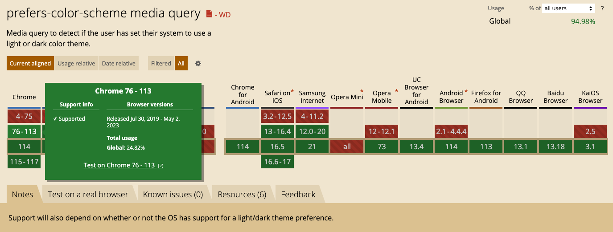

## prefers-color-scheme 媒体查询

先声明

html中加入

```
<meta name="color-scheme" content="light dark">
```
声明当前页面支持 light 和 dark 两种模式

或者css中加入
```css
:root {
    color-scheme: light dark;
}
```

通过媒体查询实现不同样式

```css
:root {
    color-scheme: light dark;
    background: white;
    color: black;
}

@media (prefers-color-scheme: dark) {
    :root {
        background: black;
        color: white;
    }
}

```

兼容性：chrome 2019.7.30 之后





## 参考

* https://zhuanlan.zhihu.com/p/187490675
* https://juejin.cn/post/6950580963638738974
* https://stackoverflow.com/questions/57449900/letting-webview-on-android-work-with-prefers-color-scheme-dark