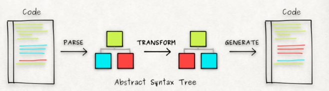

## JSX 的使用

在写 react 应用时我们通常会使用 JSX

```jsx
<MyButton color="blue" shadowSize={2}>
  Click Me
</MyButton>
```

最终会通过 babel 把这段代码编译成 js 代码

```js
React.createElement(MyButton, { color: 'blue', shadowSize: 2 }, 'Click Me')
```

那么这背后是如何实现转换的呢？

## Babel

[babel](https://github.com/babel/babel)是一个 JS 编译器，目的是将 ES6+的语法转换成 ES5 的语法

### Babel 的工作原理



```js
// 最原始版本babel
acorn.parse('var a = 1; console.log(a)')
```

```json
{
  "type": "Program",
  "start": 0,
  "body": [
    {
      "type": "VariableDeclaration",
      "start": 0,
      "declarations": [
        {
          "type": "VariableDeclarator",
          "start": 4,
          "id": { "type": "Identifier", "start": 4, "name": "a", "end": 5 },
          "init": { "type": "Literal", "start": 8, "value": 1, "end": 9 },
          "end": 9
        }
      ],
      "kind": "var",
      "end": 9
    },
    {
      "type": "ExpressionStatement",
      "start": 11,
      "expression": {
        "type": "CallExpression",
        "start": 11,
        "callee": {
          "type": "MemberExpression",
          "start": 11,
          "object": {
            "type": "Identifier",
            "start": 11,
            "name": "console",
            "end": 18
          },
          "property": {
            "type": "Identifier",
            "start": 19,
            "name": "log",
            "end": 22
          },
          "computed": false,
          "end": 22
        },
        "arguments": [
          { "type": "Identifier", "start": 23, "name": "a", "end": 24 }
        ],
        "end": 25
      },
      "end": 25
    }
  ],
  "end": 25
}
```

解析源代码生成语法树，通过插件对语法树进行操作，转换，最后依据修改后的语法树生成新的代码。

通过[@babel/plugin-transform-react-jsx](https://github.com/babel/babel/tree/main/packages/babel-plugin-transform-react-jsx)将JSX代码转换成React函数调用。