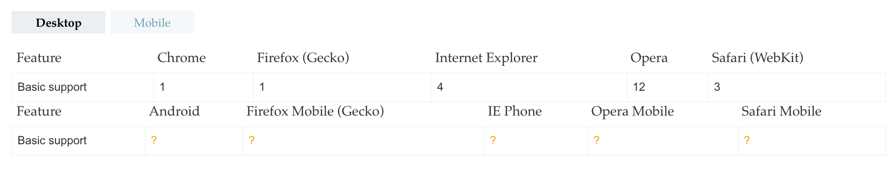
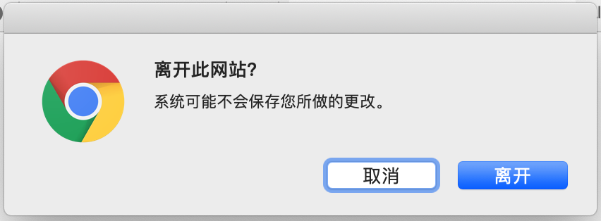

## 实现方式

### onbeforeunload
https://developer.mozilla.org/zh-CN/docs/Web/API/Window/onbeforeunload
```js
window.onbeforeunload = function (e) {
  e = e || window.event;

  // 兼容IE8和Firefox 4之前的版本
  if (e) {
    e.returnValue = '关闭提示';
  }

  // Chrome, Safari, Firefox 4+, Opera 12+ , IE 9+
  return '关闭提示';
};
```

需要注意的是：

* 从2011年5月25日起,  HTML5 规范 声明:在该事件的处理函数中调用下列弹窗相关的方法时,可以忽略不执行,window.showModalDialog(), window.alert(), window.confirm() window.prompt().

* 需要指出的是，许多浏览器会忽略该事件并自动关闭页面无需用户的确认。火狐浏览器在配置页面about:config设有一个dom.disable_beforeunload的开关变量用于开启这个功能.

* 在Firefox4及其后续版本中,返回的说明字符串并不向用户显示,也就是无法自定义说明字符串.

### 兼容性




移动端兼容性存在问题, 返回的特定说明字符串也不一定能展示给用户

实测：

移动端
Android Chrome 正常出现提示弹窗
Android Mi Browser v11.2.4-g `<a>`链接跳转不出现提示弹窗，刷新页面时会出现弹窗
IOS Safari 完全没有弹窗

PC端-macOS 10.14.6
Chrome 正常出现提示弹窗
Safari 完全没有弹窗
Firefox 正常出现弹窗

另外，在PC chrome上没有用户行为的情况下是无法阻止用户离开的。
>[Intervention] Blocked attempt to show a 'beforeunload' confirmation panel for a frame that never had a user gesture since its load.

### 能不能自定义弹窗内容？

在Chrome中离开时会出现如下弹窗



能不能自定义弹窗内容？答案是不能，除了部分浏览器可能会展示onbeforeunload回调中可能返回的字符串。

## 总结

通过onbeforeunload实现拦截用户离开页面的行为在PC和移动端都存在兼容性问题, 且无法实现自定义弹窗显示内容。
