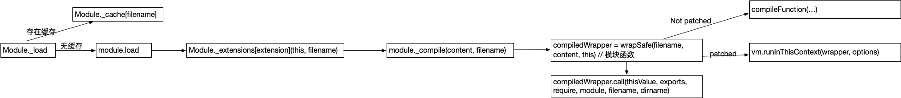

日常前端开发过程中，有时我们会使用本地文件mock接口，通过一个config map对请求和mock文件进行映射，通过middleware的方式作用在webpack devServer上，问题是config变更时需要重启devServer，而重启速度比较慢，是否有一种方式不用重启即可实现config热更新？为了解决这个问题，下面我们先了解一下Node.js中模块的工作原理，然后从中找到解决方案。

## Nodejs模块机制

Node.js的模块相关代码在[lib/module.js](https://github.com/nodejs/node/blob/master/lib/module.js)，具体实现在[lib/internal/modules/cjs/loader.js](https://github.com/nodejs/node/blob/master/lib/internal/modules/cjs/loader.js)

执行`require('a.js')`时，会调用MODULE._LOAD，为模块例化一个Module对象，然后生成模块的wapper函数，接着执行函数，缓存结果。

```js
function Module(id = '', parent) {
  this.id = id;
  this.path = path.dirname(id);
  this.exports = {};
  moduleParentCache.set(this, parent);
  updateChildren(parent, this, false);
  this.filename = null;
  this.loaded = false;
  this.children = [];
}
```

```js
Module._load = function(request, parent, isMain) {
  let relResolveCacheIdentifier;
  if (parent) {
    debug('Module._load REQUEST %s parent: %s', request, parent.id);
    // Fast path for (lazy loaded) modules in the same directory. The indirect
    // caching is required to allow cache invalidation without changing the old
    // cache key names.
    relResolveCacheIdentifier = `${parent.path}\x00${request}`;
    const filename = relativeResolveCache[relResolveCacheIdentifier];
    if (filename !== undefined) {
      const cachedModule = Module._cache[filename];
      if (cachedModule !== undefined) {
        updateChildren(parent, cachedModule, true);
        if (!cachedModule.loaded)
          return getExportsForCircularRequire(cachedModule);
        return cachedModule.exports;
      }
      delete relativeResolveCache[relResolveCacheIdentifier];
    }
  }

  const filename = Module._resolveFilename(request, parent, isMain);

  const cachedModule = Module._cache[filename];
  if (cachedModule !== undefined) { // 非初次require模块时会使用缓存
    updateChildren(parent, cachedModule, true);
    if (!cachedModule.loaded)
      return getExportsForCircularRequire(cachedModule);
    return cachedModule.exports;
  }

  const mod = loadNativeModule(filename, request);
  if (mod && mod.canBeRequiredByUsers) return mod.exports;

  // Don't call updateChildren(), Module constructor already does.
  const module = new Module(filename, parent);

  if (isMain) {
    process.mainModule = module;
    module.id = '.';
  }

  Module._cache[filename] = module;
  if (parent !== undefined) {
    relativeResolveCache[relResolveCacheIdentifier] = filename;
  }

  let threw = true;
  try {
    // Intercept exceptions that occur during the first tick and rekey them
    // on error instance rather than module instance (which will immediately be
    // garbage collected).
    if (getSourceMapsEnabled()) {
      try {
        module.load(filename);
      } catch (err) {
        rekeySourceMap(Module._cache[filename], err);
        throw err; /* node-do-not-add-exception-line */
      }
    } else {
      module.load(filename);
    }
    threw = false;
  } finally {
    if (threw) {
      delete Module._cache[filename];
      if (parent !== undefined) {
        delete relativeResolveCache[relResolveCacheIdentifier];
        const children = parent && parent.children;
        if (ArrayIsArray(children)) {
          const index = children.indexOf(module);
          if (index !== -1) {
            children.splice(index, 1);
          }
        }
      }
    } else if (module.exports &&
               !isProxy(module.exports) &&
               ObjectGetPrototypeOf(module.exports) ===
                 CircularRequirePrototypeWarningProxy) {
      ObjectSetPrototypeOf(module.exports, PublicObjectPrototype);
    }
  }

  return module.exports;
};

```

我们用一张图来说明整个调用过程



## 热更新实现

目前可实现的方案有两种：

1. 监听文件变更，然后重启应用，比如[node-supervisor](https://github.com/petruisfan/node-supervisor)、[PM2](https://github.com/Unitech/PM2)、[node-dev](https://github.com/fgnass/node-dev)
2. 监听文件变更，更新模块，不重启应用

由于重启开发server可能耗时比较长，所以我们想要的是方案2。

### 热更新且不重启

从上面Module._load的实现中我们可以看出，使`Module._cache[filename] === undefined`，这样模块会再次初始化，而不是直接返回缓存结果，另外为了防止内存泄漏，我们需要清除parent模块中对该模块的引用

具体实现如下：（需要注意的是不要在生产环境使用改代码）
```ts
function cleanModuleCache(modulePath) {
  const file = require.resolve(modulePath)
  const module = require.cache[file];
  // remove reference in module.parent
  if (module.parent) {
      module.parent.children.splice(module.parent.children.indexOf(module), 1);
  }
  require.cache[file] = undefined;
}

```

基于此，我们实现了一个简单的mock工具，会监听config文件变更，对模块进行无重启热更新，见[mini-mock](https://github.com/zenghj/mini-mock)

## 参考

* [The Node.js Way - How `require()` Actually Works](http://fredkschott.com/post/2014/06/require-and-the-module-system/)
* [Node.js Web应用代码热更新的另类思路](https://fex.baidu.com/blog/2015/05/nodejs-hot-swapping/)
* https://github.com/rlidwka/node-hotswap
* https://github.com/nodejs/node/blob/master/lib/module.js
* https://github.com/nodejs/node/blob/master/lib/internal/modules/cjs/loader.js