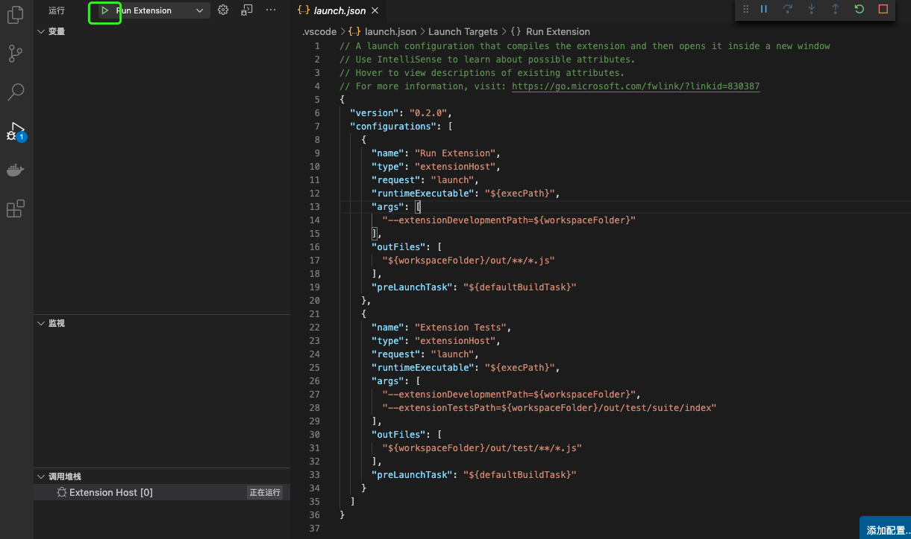
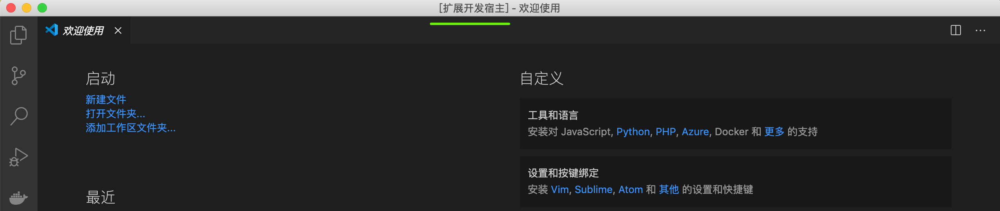
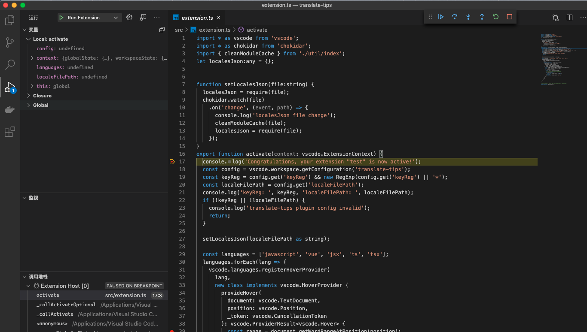

## 创建 vscode 插件项目

建议使用官方脚手架创建

```bash
# 安装脚手架工具
npm install -g yo generator-code
# or yarn global add yo generator-code

# 执行命令，依据提示初始化项目
yo code
```

项目结构

```bash
.
├── CHANGELOG.md
├── README.md
├── node_modules
├── out
├── package.json # 插件配置
├── src
│   ├── extension.ts # 插件入口
│   └── test
├── tsconfig.json
├── vsc-extension-quickstart.md
└── yarn.lock

```

`package.json`文件中有几个重要的配置项

```json
{
  // ...
  "main": "./out/extension.js", // 入口配置
  "activationEvents": [
    // 指明插件的激活时机,
    "onCommand:helloword.helloWorld",
    "onLanguage:javascript",
    "onLanguage:vue"
  ],
  "contributes": {
    "commands": [
      // 指明暴露出来的可执行的命令，用户可以打开命令面包，选中并执行这些命令
      {
        "command": "helloword.helloWorld",
        "title": "Hello World"
      }
    ],
    "capabilities": {
      "hoverProvider": "true"
    },
    "configuration": {
      // 声明配置项
    }
  },
  "publisher": "Julianzeng" // 发布插件时需要指明发布者
  // ...
}
```

## 开发

```ts
// extension.ts

// The module 'vscode' contains the VS Code extensibility API
// Import the module and reference it with the alias vscode in your code below
import * as vscode from 'vscode'

// this method is called when your extension is activated
// your extension is activated the very first time the command is executed
export function activate(context: vscode.ExtensionContext) {
  // Use the console to output diagnostic information (console.log) and errors (console.error)
  // This line of code will only be executed once when your extension is activated
  console.log('Congratulations, your extension "helloword" is now active!')

  // The command has been defined in the package.json file
  // Now provide the implementation of the command with registerCommand
  // The commandId parameter must match the command field in package.json
  let disposable = vscode.commands.registerCommand(
    'helloword.helloWorld',
    () => {
      // The code you place here will be executed every time your command is executed

      // Display a message box to the user
      vscode.window.showInformationMessage('Hello World from my first plugin!')
    }
  )

  context.subscriptions.push(disposable)
}

// this method is called when your extension is deactivated
export function deactivate() {}
```

1. 在`package.json`文件中通过contributes.commands将`helloword.helloWorld`暴露给用户；
2. 当用户在命令面板执行`helloword.helloWorld`时，由于我们通过activationEvents指定了`onCommand:helloword.helloWorld`，这时就会激活插件
3. 在插件代码中我们调用 vscode.commands.registerCommand，注册了`helloword.helloWorld`命令，当`helloword.helloWorld`命令触发时，对应的回调就会被执行


## 调试

脚手架生成的项目已经生成了调试配置文件`launch.json`,点击调试按钮即可


然后 vscode 会开启一个`[扩展开发宿主]`窗口


在`[扩展开发宿主]`窗口中打开的工作区将会使用我们正在开发的插件，在原开发插件的窗口中正常打断点即可调试。



## 打包和发布

通过`vsce`这个工具对插件进行打包和发布

```bash
# 安装vsce
npm i vsce -g

# 本地打包
vsce package
```

本地打包生成的vsix文件可以通过扩展右上角按钮选择`install from vsix`安装


### 发布

* 注册 [Azure DevOps](https://azure.microsoft.com/services/devops/)账号
* 创建publisher
* 为了使用vsce发布，需要生成[Personal Access Tokens](https://docs.microsoft.com/azure/devops/integrate/get-started/authentication/pats)
* 执行`vsce publish`

详细见[publishing-extension](https://code.visualstudio.com/api/working-with-extensions/publishing-extension)


## 实例

* [vscode-translate-tips](https://github.com/zenghj/vscode-translate-tips)
* [kiwi-linter](https://github.com/alibaba/kiwi/tree/master/kiwi-linter)

## 参考

- [官方文档](https://code.visualstudio.com/api)
- [VS Code 插件开发文档](https://liiked.github.io/VS-Code-Extension-Doc-ZH/#/)
- [microsoft/vscode-extension-samples](https://github.com/microsoft/vscode-extension-samples)
- [VSCode 插件开发全攻略](https://www.cnblogs.com/liuxianan/p/vscode-plugin-overview.html)
