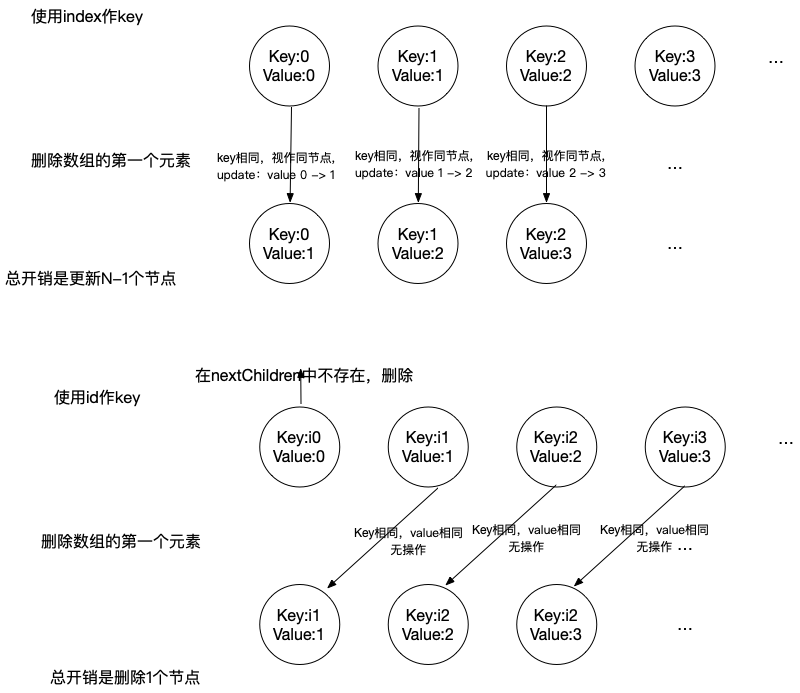
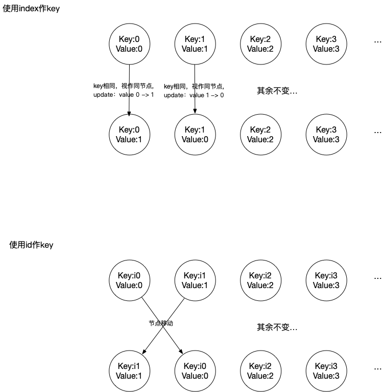
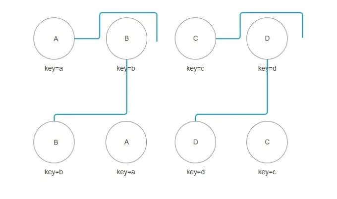
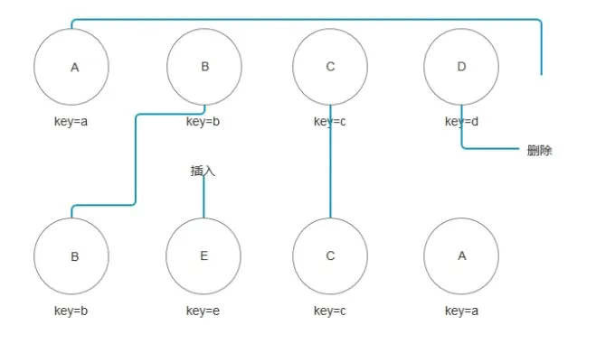
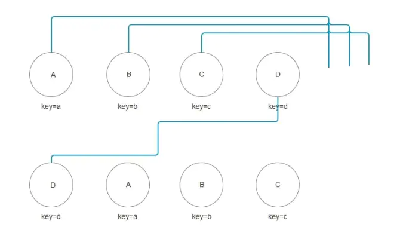

--- 
title: React Diff算法详解
date: 2020-07-16
tags:
  - React
author: Julianzeng
location: Beijing  
---

本文旨在梳理一下关于React Diff算法相关的知识。

React使用Diff算法的目的是节省Dom操作的开销, 传统的Diff算法使用循环递归对节点进行依次对比，复杂度为O(n^3),效率低下。

## React diff算法策略

* 针对树结构(tree diff)：对UI层的DOM节点跨层级的操作进行忽略。（数量少）
  > React 官方建议不要进行DOM节点的跨层级操作，可通过CSS来隐藏，显示节点，而不是真正地删除和添加DOM节点，保持稳定的DOM结构会对性能提升有帮助
* 针对组件结构(component diff)：拥有相同类的两个组件生成相似的树形结构，拥有不同类的两个组件会生成不同的属性结构。
* 针对元素结构(element-diff): 对于同一层级的一组节点，使用具有唯一性的id区分 (key属性)


## 渲染列表时不建议使用数字的index作为key的原因

假设有如下数组：
```js
const list = [{
  id: 'i0',
  value: 0,
}, {
  id: 'i1',
  value: 1,
}, {
  id: 'i2',
  value: 2,
}, {
  id: 'i3',
  value: 3,
},
// ...
];
```

初次渲染之后，将数组的第一个元素去掉得到
```js
const list = [{
  id: 'i1',
  value: 1,
}, {
  id: 'i2',
  value: 2,
}, {
  id: 'i3',
  value: 3,
},
// ...
];

```
使用index作key和使用id作为key的更新过程如下：


可以看到对于这种场景，使用id作key性能更优。

依然是原来的数组，将数组的第一个元素和第二个元素交换位置，这种情况会发生什么呢？



使用index做key，需要进行两次节点属性更新，使用id做key需要进行一次节点移动。

需要注意的是，交换位置的场景中，假如节点中包含非受控的input元素，在使用index做key时，会发生节点0中input输入框内的内容不会和节点1中input输入框内容交换，出现渲染异常的问题。

对于增加节点的场景也是类似的。下面是一个增加节点时，节点中有非受控input的例子，在输入框输入内容，然后点击“添加到头部”,使用index做key就会出现异常

```js
class App extends Component {
  constructor() {
    super()
    this.state = {
      list: [
        { name: 'zs', id: 1 },
        { name: 'ls', id: 2 },
        { name: 'ww', id: 3 }
      ]
    }
  }
  addAheadItem() {
    this.setState({
      list: [{ name: new Date().toLocaleTimeString(), id: 4 }, ...this.state.list]
    })
  }
  addBehindItem() {
    this.setState({
      list: [...this.state.list, { name: Date.now(), id: 4 }]
    })
  }
  render() {
    return (
      <div>
        <button
          onClick={() => {
            this.addAheadItem()
          }}
        >
          添加到头部
        </button>
        <button
          onClick={() => {
            this.addBehindItem()
          }}
        >
          添加到尾部
        </button>
        //使用index作为索引
        <div>
          {this.state.list.map((item, index) => {
            return (
              <li key={index}>
                {item.name}
                <input type="text" />
              </li>
            )
          })}
        </div>
        //使用id作为索引
        <div>
          {this.state.list.map((item, index) => {
            return (
              <li key={item.id}>
                {item.name}
                <input type="text" />
              </li>
            )
          })}
        </div>
      </div>
    )
  }
}
```

综合以上讨论，不论是从性能角度，还是渲染正确性的角度，都不建议列表渲染时使用index做key。

## 节点移动场景

### 节点相同，位置不同



**按新集合中顺序开始遍历**

* B在新集合中 lastIndex(类似浮标) = 0, 在旧集合中 index = 1，index > lastIndex 就认为 B 对于集合中其他元素位置无影响，不进行移动，之后lastIndex = max(index, lastIndex) = 1
* A在旧集合中 index = 0， 此时 lastIndex = 1, 满足 index < lastIndex, 则对A进行移动操作，此时lastIndex = max(Index, lastIndex) = 1
* D和B操作相同，同(1)，不进行移动，此时lastIndex=max(index, lastIndex) = 3
* C和A操作相同，同(2)，进行移动，此时lastIndex = max(index, lastIndex) = 3


### 节点有变化，位置也有变化




1. 同上面那种情形，B不进行移动，lastIndex=1
2. 新集合中取得E,发现旧中不存在E，在 lastIndex处创建E，lastIndex++
3. 在旧集合中取到C，C不移动，lastIndex=2
4. 在旧集合中取到A，A移动到新集合中的位置，lastIndex=2
5. 完成新集合中所有节点diff后，对旧集合进行循环遍历，寻找新集合中不存在但旧集合中存在的节点(此例中为D)，删除D节点。

### 从尾部移动到头部



此例中D直接从最后一位提升至第一位，导致lastIndex在第一步直接提升为3，使ABC在进行index与lastIndex的判断时均处于 index < lastIndex 的情况，使ABC都需要做移动操作。所以我们应该减少将最后一个节点提升至第一个的操作，如果操作频率较大或者节点数量较多时，会对渲染性能产生影响。


React中相关操作的代码如下,可以结合起来体会一下：
```js
    // src/renderers/shared/stack/reconciler/ReactMultiChild.js
    /**
     * @param {?object} nextNestedChildrenElements Nested child element maps.
     * @param {ReactReconcileTransaction} transaction
     * @final
     * @protected
     */
    _updateChildren: function(nextNestedChildrenElements, transaction, context) {
      var prevChildren = this._renderedChildren;
      var removedNodes = {};
      var mountImages = [];
      var nextChildren = this._reconcilerUpdateChildren(
        prevChildren,
        nextNestedChildrenElements,
        mountImages,
        removedNodes,
        transaction,
        context
      );
      if (!nextChildren && !prevChildren) {
        return;
      }
      var updates = null;
      var name;
      // `nextIndex` will increment for each child in `nextChildren`, but
      // `lastIndex` will be the last index visited in `prevChildren`.
      var nextIndex = 0;
      var lastIndex = 0;
      // `nextMountIndex` will increment for each newly mounted child.
      var nextMountIndex = 0;
      var lastPlacedNode = null;
      for (name in nextChildren) {
        if (!nextChildren.hasOwnProperty(name)) {
          continue;
        }
        var prevChild = prevChildren && prevChildren[name];
        var nextChild = nextChildren[name];
        if (prevChild === nextChild) {
          updates = enqueue(
            updates,
            this.moveChild(prevChild, lastPlacedNode, nextIndex, lastIndex)
          );
          lastIndex = Math.max(prevChild._mountIndex, lastIndex);
          prevChild._mountIndex = nextIndex;
        } else {
          if (prevChild) {
            // Update `lastIndex` before `_mountIndex` gets unset by unmounting.
            lastIndex = Math.max(prevChild._mountIndex, lastIndex);
            // The `removedNodes` loop below will actually remove the child.
          }
          // The child must be instantiated before it's mounted.
          updates = enqueue(
            updates,
            this._mountChildAtIndex(
              nextChild,
              mountImages[nextMountIndex],
              lastPlacedNode,
              nextIndex,
              transaction,
              context
            )
          );
          nextMountIndex++;
        }
        nextIndex++;
        lastPlacedNode = ReactReconciler.getHostNode(nextChild);
      }
      // Remove children that are no longer present.
      for (name in removedNodes) {
        if (removedNodes.hasOwnProperty(name)) {
          updates = enqueue(
            updates,
            this._unmountChild(prevChildren[name], removedNodes[name])
          );
        }
      }
      if (updates) {
        processQueue(this, updates);
      }
      this._renderedChildren = nextChildren;

      if (__DEV__) {
        setChildrenForInstrumentation.call(this, nextChildren);
      }
    },
```

## 总结

* React 通过制定大胆的 diff 策略，将 O(n3) 复杂度的问题转换成 O(n) 复杂度的问题；
* React 通过分层求异的策略，对 tree diff 进行算法优化；
* React 通过相同类生成相似树形结构，不同类生成不同树形结构的策略，对 component diff 进行算法优化；
* React 通过设置唯一 key的策略，对 element diff 进行算法优化；
* 建议，在开发组件时，保持稳定的 DOM 结构会有助于性能的提升；
* 建议，在开发过程中，尽量减少类似将最后一个节点移动到列表首部的操作，当节点数量过大或更新操作过于频繁时，在一定程度上会影响 React 的渲染性能。

## 参考

* [解析React Diff 算法](https://juejin.im/post/5d81eec56fb9a06add4e63ba)
* [React 源码剖析系列 － 不可思议的 react diff](https://zhuanlan.zhihu.com/p/20346379)
* [React 源码深度解读（十）：Diff 算法详解](https://segmentfault.com/a/1190000017039293)