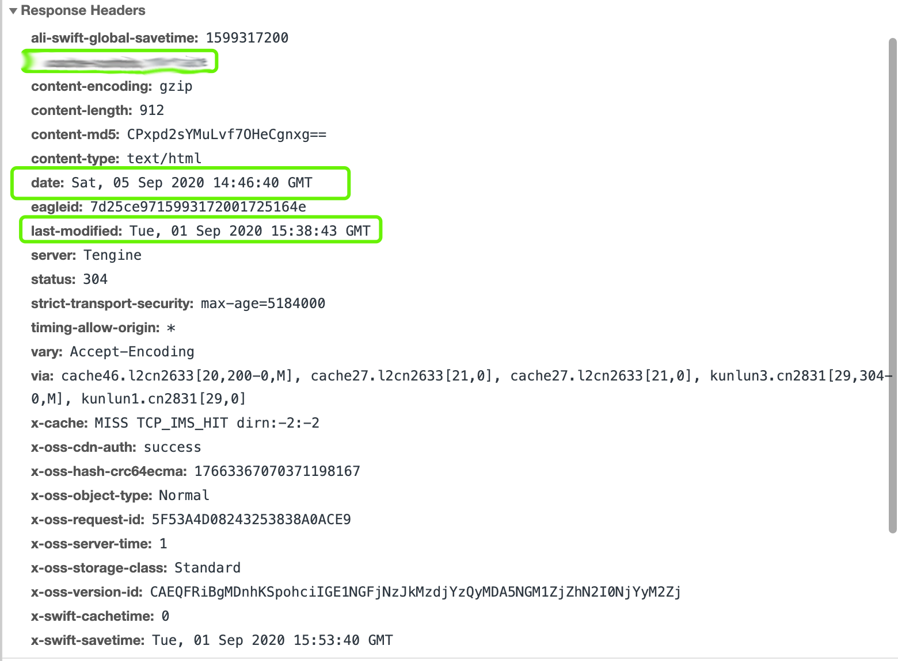
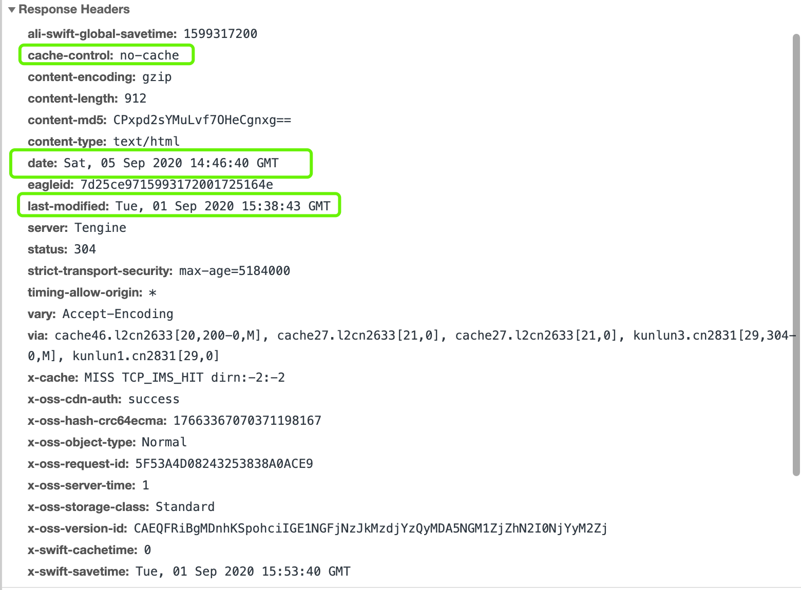

使用阿里云cdn服务托管整个页面的前端资源（html + css + js），部署更新html资源之后，发现客户端（Android webview）访问页面时页面没有更新到新的页面。查看html资源的响应头如下：

按理来说，是可以通过`last-modified`字段使用协商缓存策略的，更新html资源之后，用户应该能够拿到新的hmtl资源。

通过[查资料](https://www.jianshu.com/p/4e5049101271)发现，android webview的缓存策略好像和平常的认知有点不同

webview支持5中缓存模式：

* LOAD_CACHE_ONLY: 不发网络请求资源，只读取缓存。

* LOAD_DEFAULT: 根据cache-control或者Last-Modified决定是否从网络上取数据。默认采用该方案

* LOAD_CACHE_NORMAL: 新版本已经废弃，同LOAD_DEFAULT

* LOAD_NO_CACHE: 不使用缓存，只从网络获取数据。

* LOAD_CACHE_ELSE_NETWORK:只要本地有，无论是否过期，或者no-cache，都使用缓存中的数据。本地没有缓存时才从网络上获取。

在没有配置`cache-control`字段的情况下，浏览器会使用启发式算法策略：通过采用请求响应头中的Date减轻Last-Modified的值的10%作为缓存时间，即在这10%的时间内不发请求，直接使用缓存资源。

所以会出现更新html资源之后依然没有访问到新的页面。

解决方式就是给html资源配置`cache-control: no-cache`响应头

