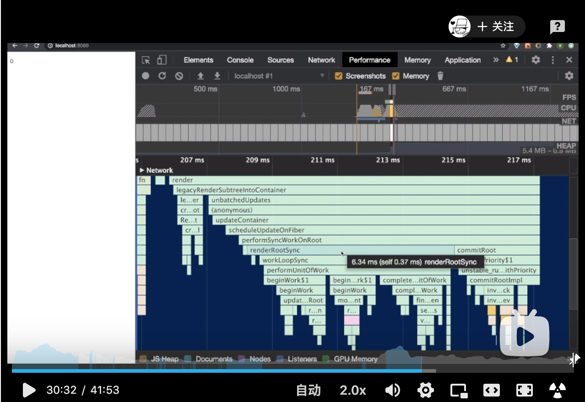

## 调试源码

以学习react源码为例：

```bash
# 1.下载源码
git clone https://github.com/facebook/react.git

# 2. 安装依赖

# 3. 打包dev

# 17.0.0 版本执行命令
yarn build react,react-dom,scheduler --type=NODE

# 17.0.0 之前版本执行命令
yarn build react/index,react-dom/index,scheduler --type=NODE

# 4. 使用yarn link对打包结果进行申明
cd build/node_modules/react
# 申明react指向
yarn link
cd build/node_modules/react-dom
# 申明react-dom指向
yarn link

# 5. 创建demo项目
npx create-react-app a-react-demo

# 6. 在新项目中，将react与react-dom2个包指向facebook/react下我们刚才生成的包
# 将项目内的react react-dom指向之前申明的包
yarn link react react-dom

```

另外，通过调用performance查看调用栈，了解代码的基本运行情况。



## 参考

* [React源码，你在第几层](https://www.bilibili.com/video/BV1Ki4y1u7Vr)
* [React技术揭秘](https://react.iamkasong.com/preparation/source.html#%E6%8B%89%E5%8F%96%E6%BA%90%E7%A0%81)